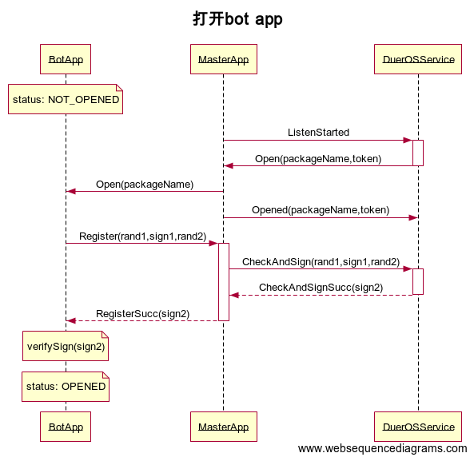
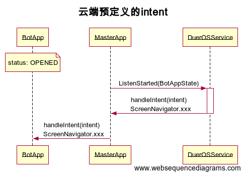
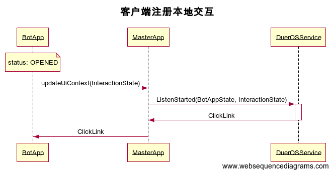

## 快速开始
[快速开始-App接入小度设备](https://github.com/dueros/AndroidBotSdkDemo/wiki/%E5%BF%AB%E9%80%9F%E5%BC%80%E5%A7%8B----APK%E6%8E%A5%E5%85%A5%E5%B0%8F%E5%BA%A6%E8%AE%BE%E5%A4%87)

[接入过程-常见问题](https://github.com/dueros/AndroidBotSdkDemo/blob/master/FAQ.md)

[问题反馈](https://github.com/dueros/AndroidBotSdkDemo/issues/3),建议去issue中提问，人人为我，我为人人！
## Demo使用指引
[文档集合](https://github.com/dueros/AndroidBotSdkDemo/tree/master/doc/%E6%8E%A5%E5%85%A5%E6%96%87%E6%A1%A3)
建议参考快速开始，跑通demo之后，再查阅文档。

核心代码介绍
- [意图处理](https://github.com/dueros/AndroidBotSdkDemo/blob/master/app/src/main/java/com/baidu/duer/test_botsdk/fragment/HandleIntentFragment.java)
- [自定义交互组件](https://github.com/dueros/AndroidBotSdkDemo/blob/master/app/src/main/java/com/baidu/duer/test_botsdk/fragment/UiControlFragment.java)
- [登录支付](https://github.com/dueros/AndroidBotSdkDemo/blob/master/app/src/main/java/com/baidu/duer/test_botsdk/fragment/PaymentAndAccountFragment.java)
- [设备信息访问](https://github.com/dueros/AndroidBotSdkDemo/blob/master/app/src/main/java/com/baidu/duer/test_botsdk/fragment/GetDeviceInfoFragment.java)

## 流程图
如下流程图简要介绍了，小度语音是如何工作的。核心流程可以理解成：
1. 开发者在DBP平台，定义语音文本和用户意图的匹配关系
2. 小度系统处理用户语音数据，解析为语音文本信息，匹配开发者预先注册的信息。返回apk可识别的字符串。
### 流程1: 打开bot app




1. 在小度设备上query 打开xxx
2. 小度云端处理用户语音指令，返回对应打开指令。（根据dbp注册技能的**唤醒名称** 和 **App包名** 匹配关系，返回应用包名）
3. 小度设备收到Open指令，根据**App包名**拉起对应Apk


### 流程2: 云端定义的intent

可以在dbp平台上定义intent，也可以是云端预定义的ScreenNavigator等指令



1. 在小度设备上query {{意图名称}}
2. 小度云端收到用户语音指令，解析并返回对应意图指令。（根据dbp平台注册技能的 **意图泛化语音指令** 和 **意图名称** 的匹配关系，返回意图flag)
3. 小度设备收到意图指令，分发给Apk。

### 流程3: 客户端custom\_user\_interaction



1. App注册自定义交互组件（就是一个 **用户语音表达** 和 **文本字串** 的匹配关系表），上传到小度云端
2. 用户在小度设备上query **用户语音表达**
3. 小度云端识别**用户语音表达** ，匹配（1）中的关系表，返回文本字串
4. 小度设备收到文本字串，并分发给Apk。
5. Apk根据预定义的文本字串和用户表达关系，就知道用户说了什么语音命令


## 真机调试过程

完成开发的app，可以在小度设备上完成测试

* 因为线上版本不支持adb调试，需要参考[文档](https://mp.weixin.qq.com/s/B6zKjIgDCyZmltn8bTwXug)开启adb权限。
* 在<font size=8 color=red>开启ADB权限的小度设备</font>上安装开发完成的android app
* 在Dbp上打开真机调试
* “打开技能调试模式”，听完设置成功的tts不要打断
* “打开【调用名称】”，android app会被启动


## BotSdk集成方式
在项目build.gradle中新增 maven库依赖
```gradle
maven{ url 'https://dueros.baidu.com/maven/repository/maven-releases/'}
maven{ url 'http://maven.baidu-int.com/nexus/content/repositories/Baidu_Local' }
```

在app/build.gradle加入依赖
```gradle
implementation 'com.alibaba:fastjson:1.1.71.android'
implementation 'com.baidu.duer.botsdk:bot-sdk-android:1.51.1'
```
混淆配置
```gradle
-keep class com.baidu.duer.** {*;}
-keep class com.baidu.operationsdk.**{*;}
```
然后参考以上代码示例进行集成
